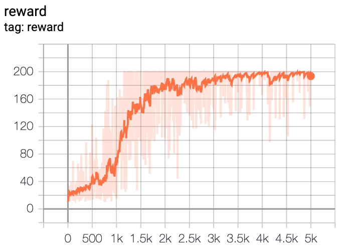

# Cartpole

Cartpole environment solved using Monte Carlo Policy Gradient (REINFORCE).

### Usage

Enter the cartpole directory
```bash
cd cartpole
``` 

To train the model, run
```bash
python run.py --mode train --ckpt_dir=checkpoints --log_dir=logs
```

To test the model, run
```bash
python run.py --mode test --ckpt_dir=checkpoints --log_dir=logs
```

Monitor training using tensorboard
```bash
tensorboard --logdir logs
```

### Results

<p align="center">
  
</p>

<p align="center">
  
</p>

