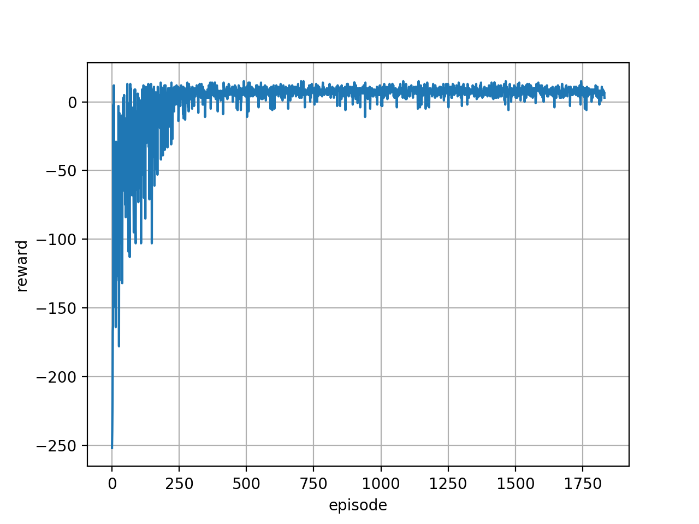

# Taxi

Taxi environment solved using tabular Q Learning.

### Usage

Enter the cartpole directory
```bash
cd taxi
``` 

To train the model, run
```bash
python run.py --mode train --ckpt_dir=checkpoints
```

To test the model, run
```bash
python run.py --mode test --ckpt_dir=checkpoints
```

### Results

<p align="center">
  
</p>

<p align="center">
  
</p>

